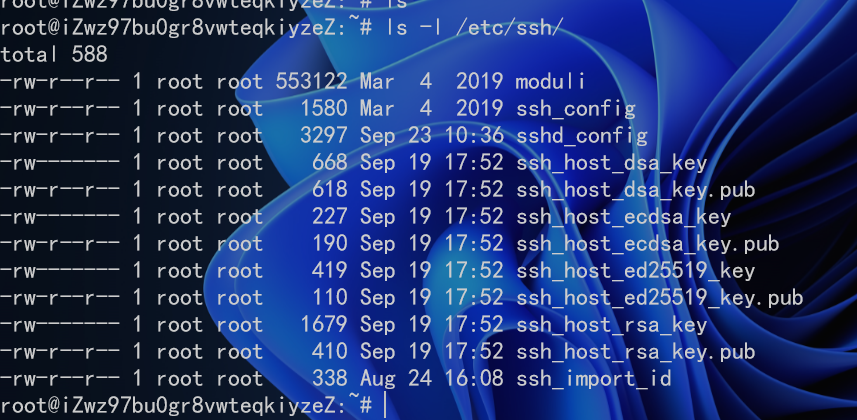

# 服务器远程登陆免密钥
之前看过一篇文章说服务器使用密码登录很可能会造成密码泄露。大概就是会有抓包工具去获取网络请求，从而得到密码。

所以自己研究一下怎么设置服务器免密码登录。（没得办法，就是爱瞎折腾）

其实主要做的也没几步，需要的也只是一个插件工具，VScode的Remote ssh而已。

## 第一步，配置服务器权限

首先使用传统方式登录服务器，然后先看一下配置文件的权限，是不是当前用户可修改的,要修改的配置文件是sshd_config



当前的就是只有root用户可修改，如果不是root用户，可以实现一下`sudo`提权

```shell
sudo vi /etc/ssh/sshd_config  # 修改登录配置文件
```

之后进行相关配置的修改，根据自己的需求来确定一下配置

```shell
#不允许密码登录
PasswordAuthentication no
#允许root认证登录
PermitRootLogin yes
#允许RSA数字证书
RSAAuthentication yes
#运行公钥登录
PubkeyAuthentication yes
#默认公钥存放的位置 
AuthorizedKeysFile  /root/.ssh/authorized_keys
```

此处公钥存放的位置就是之后上传本机密钥的位置。

## 第二步，生成本机密钥

这里使用的是win11的操作系统，应该win10也支持，使用powershell命令行工具

即使用`win+ R`打开`power shell`

### step1 、检查一下ssh keys是否存在

输入下面的命令，如果有文件`id_rsa.pub` 或 `id_dsa.pub`，则直接进入step3将SSH key添加到GitHub中，否则进入第二步生成SSH key

```shell
ls  ~/.ssh
# Lists the files in your .ssh directory, if they exist
```

### step2、生成新的ssh keys

**第一步：生成public/private rsa key pair**
 在命令行中输入`ssh-keygen -t rsa `

默认会在相应路径下（/your_home_path）生成`id_rsa`和`id_rsa.pub`两个文件，如下面代码所,直接一路回车就ok

```shell
ssh-keygen -t rsa
# Creates a new ssh key using the provided email
Generating public/private rsa key pair.
Enter file in which to save the key (C:\Users\yexui/.ssh/id_rsa):
Created directory 'C:\Users\yexui/.ssh'.
Enter passphrase (empty for no passphrase):
Enter same passphrase again:
Your identification has been saved in C:\Users\yexui/.ssh/id_rsa.
Your public key has been saved in C:\Users\yexui/.ssh/id_rsa.pub.
The key fingerprint is:
SHA256:m+yW/tQVqqnr8eV/+By9PebDfDClSIXAhyEHnOo0LRM yexui@DESKTOP-N5J3QHH
The key's randomart image is:
+---[RSA 3072]----+
|       .o+++ .   |
|      E ooo o .  |
|       +   . ..  |
|      * .   .. ..|
|     o +S  ....o |
|      .. o +..+ .|
|        =.+ o o=.|
|       .o= o  .B*|
|       +*oo ..+=B|
+----[SHA256]-----+
```

然后用cat命令将生成的公钥打印出来

```shell
PS C:\Users\yexui> cat C:\Users\yexui\.ssh\id_rsa.pub
# 将输出的结果复制一下
```

## 第三步，将密钥上传至服务器，完成登录

拿到公钥之后，再次在服务器上使用`vi`工具编辑公钥目录

```shell
vi /root/.ssh/authorized_keys
```

然后将复制的公钥黏贴进去就大功告成了，然后试一下登录有没有直接成功就欧克。